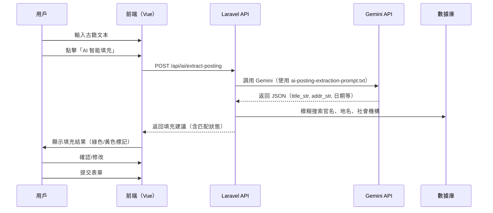

# AI 智能填充任官資訊 - 設計方案

## 1. 功能概述

在 `/basicinformation/{id}/offices/create` 頁面中，提供 AI 智能填充功能，協助編輯者從古籍文本中提取任官信息並自動填充表單。

### 1.1 用戶場景

1. 用戶在「新增官名」頁面上方的文本框中貼上古籍原文（如：「雍正元年正月初三知陝西新城縣至於六月十五卒于任」）
2. 點擊「AI 智能填充」按鈕
3. 系統調用 AI 提取結構化資訊並嘗試匹配數據庫選項
4. 前端顯示填充結果：
   - ✅ 成功匹配的欄位（綠色標記）
   - ⚠️ 需要用戶確認的欄位（黃色標記，顯示 AI 建議值）
   - ❌ 無法提取的欄位（保持空白）
5. 用戶確認/修改後提交表單

### 1.2 技術可行性

✅ **高度可行**：
- 系統已有 Gemini API 配置和調用經驗（自然語言查詢功能）
- `ai-posting-extraction-prompt.txt` 提供了完整的 prompt 模板
- AI 返回的 JSON 字段與表單欄位映射清晰

⚠️ **需要注意**：
- 部分欄位需要模糊匹配（官名、地名、社會機構）
- UI/UX 需要清晰顯示 AI 建議與匹配狀態

---

## 2. 架構設計

### 2.1 技術棧

- **後端**：Laravel 12.0 + PHP 8.2+
- **AI 服務**：Google Gemini API（已配置在 `.env`）
- **前端**：Vue 3 + jQuery + Select2
- **API 端點**：新增 RESTful API 處理 AI 提取和模糊匹配

### 2.2 系統流程圖



---

## 3. 實現方案（推薦方案 C）

### 3.1 方案對比

| 方案 | 描述 | 優點 | 缺點 | 推薦度 |
|------|------|------|------|--------|
| **方案 A** | AI 直接填充表單 | 實現簡單 | 無法保證匹配準確性，用戶體驗差 | ❌ 不推薦 |
| **方案 B** | AI 輔助 + 候選項建議 | 提供建議值，用戶可選擇 | 需要用戶逐項確認，效率一般 | ⚠️ 可行 |
| **方案 C** | AI 預填 + 高亮未匹配項 | 自動匹配 + 清晰標示，用戶體驗最佳 | 前端邏輯較複雜 | ✅ **推薦** |

### 3.2 方案 C 詳細設計

#### 3.2.1 UI 設計

在表單頂部新增「AI 智能填充」區塊：

```html
<!-- 新增區塊（插入到表單開頭） -->
<div class="card card-info mb-3" id="ai-autofill-section">
  <div class="card-header">
    <h3 class="card-title">
      <i class="fas fa-magic"></i> AI 智能填充
    </h3>
  </div>
  <div class="card-body">
    <div class="form-group">
      <label for="ai-source-text">原始文本（請貼上包含任官記錄的文本）</label>
      <textarea class="form-control" id="ai-source-text" rows="4"
                placeholder="例如：雍正元年正月初三知陝西新城縣至於六月十五卒于任"></textarea>
    </div>
    <button type="button" class="btn btn-primary" id="btn-ai-autofill">
      <i class="fas fa-robot"></i> AI 智能填充
    </button>
    <button type="button" class="btn btn-secondary" id="btn-clear-ai" style="display:none;">
      <i class="fas fa-eraser"></i> 清除 AI 建議
    </button>
    <span class="ml-3" id="ai-status"></span>
  </div>
</div>

<!-- 填充結果摘要（成功後顯示） -->
<div class="alert alert-success" id="ai-result-summary" style="display:none;">
  <h5><i class="fas fa-check-circle"></i> AI 填充完成</h5>
  <ul>
    <li>✅ <strong id="matched-count">0</strong> 個欄位成功匹配</li>
    <li>⚠️ <strong id="suggested-count">0</strong> 個欄位需要確認（黃色標記）</li>
    <li>❌ <strong id="empty-count">0</strong> 個欄位無法提取</li>
  </ul>
  <button type="button" class="btn btn-sm btn-success" id="btn-accept-all">
    <i class="fas fa-check-double"></i> 接受全部建議
  </button>
</div>
```

#### 3.2.2 欄位標記系統

使用顏色標記填充狀態：

- 🟢 **綠色底色**：成功匹配數據庫選項，自動填充
- 🟡 **黃色底色**：AI 提取了值但未找到精確匹配，顯示建議值
- ⚪ **無標記**：AI 未提取到值，保持空白

```css
/* 新增 CSS 樣式 */
.ai-matched {
  background-color: #d4edda !important; /* 綠色 */
  border-color: #28a745 !important;
}

.ai-suggested {
  background-color: #fff3cd !important; /* 黃色 */
  border-color: #ffc107 !important;
}

.ai-field-label {
  position: relative;
}

.ai-field-label::after {
  content: "🤖 AI 建議";
  font-size: 0.75rem;
  color: #856404;
  margin-left: 8px;
}
```

#### 3.2.3 後端 API 設計

**新增 Service：`PostingAutofillService.php`**

```php
<?php

namespace App\Services;

use Illuminate\Support\Facades\Http;
use Illuminate\Support\Facades\Log;
use Illuminate\Support\Facades\DB;

class PostingAutofillService {
    protected string $apiKey;
    protected string $apiEndpoint;
    protected string $model;
    protected string $promptTemplate;

    public function __construct() {
        // 完全從 config 讀取，config 層會從 .env 讀取並提供 fallback
        // 不在 Service 層 hard coding 任何默認值
        $this->apiKey = config('services.gemini.api_key', '');
        $this->apiEndpoint = config('services.gemini.api_endpoint');
        $this->model = config('services.gemini.model');

        // 讀取 prompt 模板（AI 任官信息提取 prompt）
        $this->promptTemplate = storage_path('app/prompts/ai-posting-extraction-prompt.txt');
    }

    /**
     * 從古籍文本提取任官信息並返回填充建議
     *
     * @param string $sourceText 原始文本
     * @param int $personId 人物 ID（用於查詢候選出處）
     * @return array ['success' => bool, 'data' => array, 'error' => string|null]
     */
    public function extractAndMatch(string $sourceText, int $personId): array {
        if (empty($this->apiKey)) {
            return [
                'success' => false,
                'data' => null,
                'error' => 'AI API 未配置，請聯繫管理員',
            ];
        }

        try {
            // 1. 調用 AI 提取結構化數據
            $extractResult = $this->callAI($sourceText);

            if (!$extractResult['success']) {
                return $extractResult;
            }

            $aiData = $extractResult['data'];

            // 2. 對每個欄位進行模糊匹配
            $matchResult = $this->matchFields($aiData, $personId);

            return [
                'success' => true,
                'data' => [
                    'ai_extracted' => $aiData, // AI 原始提取結果
                    'matched_fields' => $matchResult['matched'], // 成功匹配的欄位
                    'suggested_fields' => $matchResult['suggested'], // 建議值（未匹配）
                    'empty_fields' => $matchResult['empty'], // 未提取的欄位
                    'statistics' => [
                        'matched_count' => count($matchResult['matched']),
                        'suggested_count' => count($matchResult['suggested']),
                        'empty_count' => count($matchResult['empty']),
                    ],
                ],
                'error' => null,
            ];

        } catch (\Exception $e) {
            Log::error('AI 提取任官信息失敗', [
                'exception' => $e->getMessage(),
                'trace' => $e->getTraceAsString(),
            ]);

            return [
                'success' => false,
                'data' => null,
                'error' => '處理失敗：' . $e->getMessage(),
            ];
        }
    }

    /**
     * 調用 AI API 提取結構化數據
     */
    protected function callAI(string $sourceText): array {
        // 讀取 prompt 模板
        if (!file_exists($this->promptTemplate)) {
            return [
                'success' => false,
                'data' => null,
                'error' => 'Prompt 模板檔案不存在',
            ];
        }

        $promptContent = file_get_contents($this->promptTemplate);
        $fullPrompt = $promptContent . "\n\n" . $sourceText;

        // 調用 Gemini API
        $response = Http::timeout(30)
            ->withHeaders([
                'Content-Type' => 'application/json',
                'Authorization' => 'Bearer ' . $this->apiKey,
            ])
            ->post($this->apiEndpoint, [
                'model' => $this->model,
                'messages' => [
                    [
                        'role' => 'user',
                        'content' => $fullPrompt,
                    ],
                ],
                'temperature' => 0.1,
                'response_format' => [
                    'type' => 'json_schema',
                    'json_schema' => [
                        'name' => 'posting_extraction',
                        'strict' => true,
                        'schema' => $this->getJsonSchema(),
                    ],
                ],
            ]);

        if (!$response->successful()) {
            return [
                'success' => false,
                'data' => null,
                'error' => 'AI API 調用失敗：' . $response->body(),
            ];
        }

        $responseData = $response->json();
        $content = $responseData['choices'][0]['message']['content'] ?? null;

        if (!$content) {
            return [
                'success' => false,
                'data' => null,
                'error' => 'AI 返回格式錯誤',
            ];
        }

        $jsonData = json_decode($content, true);

        if (json_last_error() !== JSON_ERROR_NONE) {
            return [
                'success' => false,
                'data' => null,
                'error' => 'JSON 解析失敗：' . json_last_error_msg(),
            ];
        }

        // 提取第一筆任官記錄（通常一次只錄入一筆）
        $postings = $jsonData['postings'] ?? [];

        if (empty($postings)) {
            return [
                'success' => false,
                'data' => null,
                'error' => '未能從文本中提取任官信息',
            ];
        }

        return [
            'success' => true,
            'data' => $postings[0], // 返回第一筆
            'error' => null,
        ];
    }

    /**
     * 對 AI 提取的數據進行模糊匹配
     */
    protected function matchFields(array $aiData, int $personId): array {
        $matched = [];
        $suggested = [];
        $empty = [];

        // 1. 官名匹配（title_str）
        if (!empty($aiData['title_str'])) {
            $officeMatch = $this->fuzzyMatchOffice($aiData['title_str']);
            if ($officeMatch) {
                $matched['c_office_id'] = [
                    'value' => $officeMatch['id'],
                    'text' => $officeMatch['text'],
                    'ai_extracted' => $aiData['title_str'],
                ];
            } else {
                $suggested['c_office_id'] = [
                    'ai_extracted' => $aiData['title_str'],
                    'search_query' => $aiData['title_str'],
                ];
            }
        } else {
            $empty[] = 'c_office_id';
        }

        // 2. 地名匹配（addr_str）
        if (!empty($aiData['addr_str'])) {
            $addrMatch = $this->fuzzyMatchAddress($aiData['addr_str']);
            if ($addrMatch) {
                $matched['c_addr'] = [
                    'value' => [$addrMatch['id']],
                    'text' => [$addrMatch['text']],
                    'ai_extracted' => $aiData['addr_str'],
                ];
            } else {
                $suggested['c_addr'] = [
                    'ai_extracted' => $aiData['addr_str'],
                    'search_query' => $aiData['addr_str'],
                ];
            }
        } else {
            $empty[] = 'c_addr';
        }

        // 3. 直接映射欄位（不需要模糊匹配）
        $directMappings = [
            'c_firstyear' => 'c_firstyear',
            'c_fy_nh_code' => 'c_fy_nh_code',
            'c_fy_nh_year' => 'c_fy_nh_year',
            'c_fy_range' => 'c_fy_range',
            'c_fy_intercalary' => 'c_fy_intercalary',
            'c_fy_month' => 'c_fy_month',
            'c_fy_day' => 'c_fy_day',
            'c_fy_day_gz' => 'c_fy_day_gz',
            'c_lastyear' => 'c_lastyear',
            'c_ly_nh_code' => 'c_ly_nh_code',
            'c_ly_nh_year' => 'c_ly_nh_year',
            'c_ly_range' => 'c_ly_range',
            'c_ly_intercalary' => 'c_ly_intercalary',
            'c_ly_month' => 'c_ly_month',
            'c_ly_day' => 'c_ly_day',
            'c_ly_day_gz' => 'c_ly_day_gz',
            'c_appt_code' => 'c_appt_code',
            'c_assume_office_code' => 'c_assume_office_code',
        ];

        foreach ($directMappings as $fieldName => $aiKey) {
            if (isset($aiData[$aiKey]) && $aiData[$aiKey] !== null) {
                $matched[$fieldName] = [
                    'value' => $aiData[$aiKey],
                    'text' => $aiData[$aiKey],
                ];
            } else {
                $empty[] = $fieldName;
            }
        }

        return [
            'matched' => $matched,
            'suggested' => $suggested,
            'empty' => $empty,
        ];
    }

    /**
     * 模糊匹配官名
     */
    protected function fuzzyMatchOffice(string $officeName): ?array {
        // 使用 LIKE 查詢（優先精確匹配，其次前綴匹配）
        $result = DB::table('OFFICE_CODES')
            ->select('c_office_id as id', 'c_office as text')
            ->where('c_office', '=', $officeName)
            ->first();

        if ($result) {
            return (array) $result;
        }

        // 前綴匹配
        $result = DB::table('OFFICE_CODES')
            ->select('c_office_id as id', 'c_office as text')
            ->where('c_office', 'like', $officeName . '%')
            ->first();

        return $result ? (array) $result : null;
    }

    /**
     * 模糊匹配地名
     */
    protected function fuzzyMatchAddress(string $addrName): ?array {
        // 使用 LIKE 查詢
        $result = DB::table('ADDRESSES')
            ->select('c_addr_id as id', 'c_name_chn as text')
            ->where('c_name_chn', '=', $addrName)
            ->first();

        if ($result) {
            return (array) $result;
        }

        // 前綴匹配
        $result = DB::table('ADDRESSES')
            ->select('c_addr_id as id', 'c_name_chn as text')
            ->where('c_name_chn', 'like', $addrName . '%')
            ->first();

        return $result ? (array) $result : null;
    }

    /**
     * 獲取 JSON Schema（用於 Structured Output）
     */
    protected function getJsonSchema(): array {
        return [
            'type' => 'object',
            'properties' => [
                'postings' => [
                    'type' => 'array',
                    'items' => [
                        'type' => 'object',
                        'properties' => [
                            'title_str' => ['type' => 'string'],
                            'addr_str' => ['type' => ['string', 'null']],
                            'c_firstyear' => ['type' => ['integer', 'null']],
                            'c_fy_nh_code' => ['type' => ['string', 'null']],
                            'c_fy_nh_year' => ['type' => ['integer', 'null']],
                            'c_fy_range' => ['type' => ['integer', 'null']],
                            'c_fy_intercalary' => ['type' => ['boolean', 'null']],
                            'c_fy_month' => ['type' => ['integer', 'null']],
                            'c_fy_day' => ['type' => ['integer', 'null']],
                            'c_fy_day_gz' => ['type' => ['string', 'null']],
                            'c_lastyear' => ['type' => ['integer', 'null']],
                            'c_ly_nh_code' => ['type' => ['string', 'null']],
                            'c_ly_nh_year' => ['type' => ['integer', 'null']],
                            'c_ly_range' => ['type' => ['integer', 'null']],
                            'c_ly_intercalary' => ['type' => ['boolean', 'null']],
                            'c_ly_month' => ['type' => ['integer', 'null']],
                            'c_ly_day' => ['type' => ['integer', 'null']],
                            'c_ly_day_gz' => ['type' => ['string', 'null']],
                            'c_appt_code' => ['type' => ['integer', 'null']],
                            'c_assume_office_code' => ['type' => ['integer', 'null']],
                        ],
                        'required' => ['title_str'],
                        'additionalProperties' => false,
                    ],
                ],
            ],
            'required' => ['postings'],
            'additionalProperties' => false,
        ];
    }
}
```

**新增 Controller：`AiPostingAutofillController.php`**

```php
<?php

namespace App\Http\Controllers;

use App\Services\PostingAutofillService;
use Illuminate\Http\Request;
use Illuminate\Support\Facades\Auth;

class AiPostingAutofillController extends Controller {
    protected PostingAutofillService $autofillService;

    public function __construct(PostingAutofillService $autofillService) {
        $this->middleware('auth');
        $this->autofillService = $autofillService;
    }

    /**
     * 從古籍文本提取任官信息
     *
     * @param Request $request
     * @return \Illuminate\Http\JsonResponse
     */
    public function extract(Request $request) {
        // 權限檢查：只有能直接寫入的用戶才能使用 AI 功能
        if (!Auth::user()->canWriteDirectly()) {
            return response()->json([
                'success' => false,
                'error' => '您沒有使用 AI 功能的權限',
            ], 403);
        }

        $request->validate([
            'source_text' => 'required|string|max:5000',
            'person_id' => 'required|integer',
        ]);

        $sourceText = $request->input('source_text');
        $personId = $request->input('person_id');

        $result = $this->autofillService->extractAndMatch($sourceText, $personId);

        if (!$result['success']) {
            return response()->json($result, 400);
        }

        return response()->json($result);
    }
}
```

**新增路由（`routes/web.php`）**

```php
// AI 智能填充任官信息
Route::post('/api/ai/posting/extract', [AiPostingAutofillController::class, 'extract'])
    ->name('ai.posting.extract');
```

#### 3.2.4 前端實現（Vue + jQuery）

**新增 JavaScript 邏輯（插入到 `_form.blade.php` 的 `@section('js')` 中）**

```javascript
// AI 智能填充功能
(function() {
    const $aiSection = $('#ai-autofill-section');
    const $aiSourceText = $('#ai-source-text');
    const $btnAiAutofill = $('#btn-ai-autofill');
    const $btnClearAi = $('#btn-clear-ai');
    const $aiStatus = $('#ai-status');
    const $aiResultSummary = $('#ai-result-summary');
    const $btnAcceptAll = $('#btn-accept-all');

    let aiSuggestions = null; // 儲存 AI 建議結果

    // 點擊「AI 智能填充」按鈕
    $btnAiAutofill.on('click', function() {
        const sourceText = $aiSourceText.val().trim();

        if (!sourceText) {
            alert('請先輸入原始文本');
            return;
        }

        // 顯示載入狀態
        $btnAiAutofill.prop('disabled', true);
        $aiStatus.html('<span class="text-info"><i class="fas fa-spinner fa-spin"></i> AI 處理中...</span>');

        // 調用 API
        $.ajax({
            url: '{{ route("ai.posting.extract", [], false) }}',
            method: 'POST',
            data: {
                source_text: sourceText,
                person_id: {{ $id }},
                _token: '{{ csrf_token() }}'
            },
            success: function(response) {
                if (response.success) {
                    aiSuggestions = response.data;
                    applyAiSuggestions(aiSuggestions);

                    // 顯示結果摘要
                    $aiResultSummary.show();
                    $('#matched-count').text(response.data.statistics.matched_count);
                    $('#suggested-count').text(response.data.statistics.suggested_count);
                    $('#empty-count').text(response.data.statistics.empty_count);

                    $btnClearAi.show();
                    $aiStatus.html('<span class="text-success"><i class="fas fa-check-circle"></i> 填充完成</span>');
                } else {
                    $aiStatus.html('<span class="text-danger"><i class="fas fa-exclamation-circle"></i> ' + response.error + '</span>');
                }
            },
            error: function(xhr) {
                const errorMsg = xhr.responseJSON?.error || '請求失敗';
                $aiStatus.html('<span class="text-danger"><i class="fas fa-exclamation-circle"></i> ' + errorMsg + '</span>');
            },
            complete: function() {
                $btnAiAutofill.prop('disabled', false);
            }
        });
    });

    // 應用 AI 建議到表單
    function applyAiSuggestions(data) {
        const matched = data.matched_fields;
        const suggested = data.suggested_fields;

        // 清除舊的標記
        $('.ai-matched, .ai-suggested').removeClass('ai-matched ai-suggested');
        $('.ai-field-label').removeClass('ai-field-label');

        // 1. 填充成功匹配的欄位（綠色）
        for (const [fieldName, fieldData] of Object.entries(matched)) {
            const $field = $(`[name="${fieldName}"]`);

            if ($field.is('select')) {
                // Select2 欄位
                if (Array.isArray(fieldData.value)) {
                    // 多選（如地址）
                    fieldData.value.forEach(val => {
                        const option = new Option(fieldData.text[fieldData.value.indexOf(val)], val, true, true);
                        $field.append(option);
                    });
                } else {
                    // 單選
                    const option = new Option(fieldData.text, fieldData.value, true, true);
                    $field.append(option).trigger('change');
                }
                $field.addClass('ai-matched');
            } else {
                // 普通 input
                $field.val(fieldData.value).addClass('ai-matched');
            }

            // 標記 label
            $field.closest('.form-group').find('label').addClass('ai-field-label');
        }

        // 2. 顯示建議值（黃色）
        for (const [fieldName, fieldData] of Object.entries(suggested)) {
            const $field = $(`[name="${fieldName}"]`);

            if ($field.is('select')) {
                // 創建臨時建議選項
                const option = new Option(
                    `⚠️ AI 建議：${fieldData.ai_extracted}（請搜索確認）`,
                    '',
                    true,
                    true
                );
                $field.append(option).trigger('change');
                $field.addClass('ai-suggested');
            } else {
                $field.val(fieldData.ai_extracted).addClass('ai-suggested');
            }

            $field.closest('.form-group').find('label').addClass('ai-field-label');
        }
    }

    // 清除 AI 建議
    $btnClearAi.on('click', function() {
        if (!confirm('確定要清除所有 AI 填充的內容嗎？')) {
            return;
        }

        // 清除標記和值
        $('.ai-matched, .ai-suggested').each(function() {
            const $field = $(this);

            if ($field.is('select')) {
                $field.val(null).trigger('change');
            } else {
                $field.val('');
            }

            $field.removeClass('ai-matched ai-suggested');
        });

        $('.ai-field-label').removeClass('ai-field-label');
        $aiResultSummary.hide();
        $btnClearAi.hide();
        $aiStatus.empty();
        aiSuggestions = null;
    });

    // 接受全部建議（將黃色欄位標記為綠色）
    $btnAcceptAll.on('click', function() {
        $('.ai-suggested').removeClass('ai-suggested').addClass('ai-matched');

        // 更新摘要
        const matchedCount = $('.ai-matched').length;
        $('#matched-count').text(matchedCount);
        $('#suggested-count').text(0);

        alert('已接受所有 AI 建議');
    });
})();
```

---

## 4. 實施步驟

### 階段一：基礎架構（1-2 天）

1. ✅ 將 `ai-posting-extraction-prompt.txt` 複製到 `storage/app/prompts/ai-posting-extraction-prompt.txt`
2. ✅ 創建 `PostingAutofillService.php`
3. ✅ 創建 `AiPostingAutofillController.php`
4. ✅ 添加路由到 `routes/web.php`
5. ✅ 編寫 PHPUnit 測試（`tests/Feature/AiPostingAutofillTest.php`）

### 階段二：前端整合（1-2 天）

1. ✅ 修改 `_form.blade.php`，添加 AI 智能填充區塊
2. ✅ 實現 JavaScript 邏輯（AJAX 調用、表單填充、標記系統）
3. ✅ 添加 CSS 樣式
4. ✅ 測試 UI/UX 流程

### 階段三：優化與測試（1-2 天）

1. ✅ 改進模糊匹配算法（考慮使用姓名搜索索引）
2. ✅ 添加用戶日誌記錄（記錄 AI 使用情況）
3. ✅ 全面測試（不同類型的任官文本）
4. ✅ 性能優化（緩存常見官名、地名匹配結果）

---

## 5. 風險與應對

### 5.1 AI 提取準確性問題

**風險**：AI 可能誤解古籍文本，提取錯誤信息。

**應對**：
- 使用 `temperature=0.1`（低溫度）確保輸出穩定
- 提供清晰的摘要，用戶可以快速檢查
- 黃色標記未匹配項，強制用戶確認

### 5.2 模糊匹配失敗率高

**風險**：官名、地名變體多，簡單 LIKE 查詢匹配率低。

**應對**：
- 階段一使用簡單 LIKE 查詢，快速上線
- 階段二整合姓名搜索索引（`CBDB__NAME_FTS`）進行模糊匹配
- 階段三考慮引入編輯距離算法（Levenshtein）

### 5.3 API 配額限制

**風險**：Gemini API 有請求頻率限制。

**應對**：
- 在前端添加請求節流（每個用戶每分鐘最多 5 次請求）
- 記錄 API 使用日誌，監控配額
- 考慮本地緩存常見文本的提取結果

---

## 6. 後續擴展

### 6.1 批量導入

支持從 Excel/CSV 批量導入任官記載，使用 AI 逐條處理。

### 6.2 智能建議歷史

記錄用戶對 AI 建議的接受/拒絕行為，用於改進模糊匹配算法。

### 6.3 多語言支持

擴展到其他類型的記載（如親屬關係、出處頁碼提取等）。

---

## 7. 配置清單

### 7.1 環境變數（`.env`）

```bash
# Google Gemini API（已有配置，無需修改）
GEMINI_API_KEY=your_api_key_here
GEMINI_MODEL=gemini-3-flash-preview
```

### 7.2 檔案結構

```
app/
├── Services/
│   └── PostingAutofillService.php      # AI 提取與匹配服務
├── Http/Controllers/
│   └── AiPostingAutofillController.php # API 控制器

storage/app/prompts/
└── ai-posting-extraction-prompt.txt                   # AI Prompt 模板

resources/views/biogmains/offices/
└── _form.blade.php                      # 修改表單，添加 AI 區塊

tests/Feature/
└── AiPostingAutofillTest.php           # 功能測試

routes/
└── web.php                              # 添加路由
```

---

## 8. 總結

### 8.1 優點

✅ **提高錄入效率**：AI 自動提取結構化數據，減少手動輸入
✅ **降低錯誤率**：AI 標準化日期、官名格式
✅ **良好的用戶體驗**：清晰的顏色標記，用戶能快速確認
✅ **擴展性強**：可應用於其他類型的資料錄入

### 8.2 挑戰

⚠️ **模糊匹配準確性**：需要持續優化算法
⚠️ **AI 成本**：每次請求消耗 API 配額
⚠️ **用戶培訓**：需要向編輯者說明如何使用 AI 功能

### 8.3 建議

建議採用**分階段實施**策略：
1. **MVP（最小可行產品）**：實現基礎 AI 提取 + 簡單模糊匹配
2. **改進版**：優化匹配算法，添加用戶反饋機制
3. **完整版**：批量導入、歷史學習、多場景擴展

---

**文檔版本**：v1.0
**撰寫日期**：2026-02-02
**撰寫者**：Claude (Sonnet 4.5)
